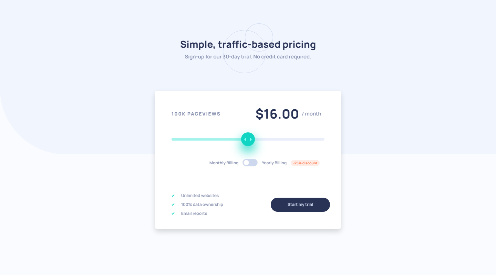

# Frontend Mentor - Interactive pricing component solution

This is a solution to the [Interactive pricing component challenge on Frontend Mentor](https://www.frontendmentor.io/challenges/interactive-pricing-component-t0m8PIyY8). Frontend Mentor challenges help you improve your coding skills by building realistic projects. 

## Table of contents

- [Overview](#overview)
  - [The challenge](#the-challenge)
  - [Screenshot](#screenshot)
  - [Links](#links)
- [My process](#my-process)
  - [Built with](#built-with)
  - [What I learned](#what-i-learned)
  - [Continued development](#continued-development)
  - [Useful resources](#useful-resources)
- [Author](#author)

**Note: Delete this note and update the table of contents based on what sections you keep.**

## Overview

### The challenge

Users should be able to:

- View the optimal layout for the app depending on their device's screen size
- See hover states for all interactive elements on the page
- Use the slider and toggle to see prices for different page view numbers

### Screenshot

### Links

- HTML Solution URL: [HTML](https://github.com/JustANipple/interactive-pricing-component/blob/master/index.html)
- CSS Solution URL: [CSS](https://github.com/JustANipple/interactive-pricing-component/blob/master/styles/css/main.css)
- JS Solution URL: [JS](https://github.com/JustANipple/interactive-pricing-component/blob/master/scripts/script.js)
- Live Site URL: [LIVE](https://justanipple.github.io/interactive-pricing-component/)

## My process

### Built with

- Semantic HTML5 markup
- CSS custom properties
- Flexbox
- CSS Grid
- Mobile-first workflow
- Bootstrap

### What I learned

This was my first time using Bootstrap. I made this project several times to make it working and make the code as clean as possible

### Continued development

Bootstrap has huge potential, so i'll still work on it to improve

### Useful resources

- [Bootstrap](https://getbootstrap.com/docs/5.3/getting-started/introduction/) - This official Bootstrap documentation helped me a lot with styling

## Author

- Frontend Mentor - [@JustANipple](https://www.frontendmentor.io/profile/JustANipple)
